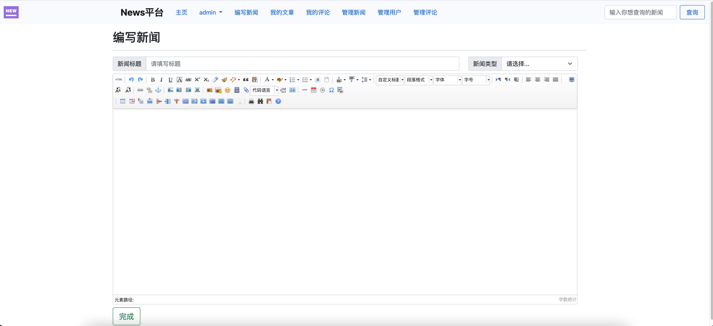

# NewsPlatform
基于Spring Boot、Bootstrap 5开发的新闻浏览发布平台


## 上手指南

1. 下载或 git clone 本项目 

   ```sh
   git clone https://github.com/Chionanthus/NewsPlatform.git
   ```

2. 在数据库中创建newsplatform数据库，并执行newsplatform.sql中的建表语句

   ```mysql
   create database newsplatform;
   use newsplatform
   ```

3. 手动创建管理员，即将user表中role一栏设为3

   ```mysql
   insert into user(user_name,user_password,role) values('admin','admin','3')
   ```

4. 修改src/main/resources/application.properties下spring.datasource下的相关部分，修改web.upload-path的路径

5. mvn 下载好相关依赖后即可运行，路径为localhost:8989/news

   

   

   

   

## 可进一步完成的工作

1. 目前密码是明文加密，可编写MD5Util实现加密存储
1. 使用Spring Securtiy进行用户权限管理

3. 使用Vue.js重构前端
4. 添加浏览量等功能
